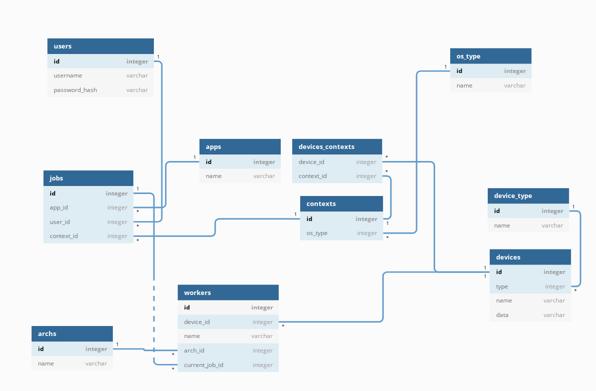

# Remote Execution System

## Table of Contents

- [About](#about)
- [Oprogranowanie](#software)
- [Moduły](#modules)
- [DBML](#dbml)
- [SQL Create](#sql_create)
- [SQL Init](#sql_init)

## About <a name = "about"></a>

System zdalnego wykonywanie kodu na klastrach obliczeniowych.


## Oprogramowanie <a name = "software"></a>

Baza danych SQLite 3


## Moduły <a name = "modules"></a>

Moduly projektu z odpowiadajacymi tabelami.

> obsluga uzytkownikow [users]

> zadania   [jobs]

> aplikacje [apps]

> rozno-architekturowe multiprocesory [workers, archs]

> systemy operacyjne [os_type]

> dynamiczne konteksty zadan [context]

> urzadzenia [devieces. device_contexts, device_type]

## Diagram

Diagram tabel z relacjami




## DBML <a name = "dbml"></a>

```
table users {
    id              integer [pk, unique]
    username        varchar [unique, 
    ...
``` 
[more...](tables.dbml)


## SQL Create <a name = "sql_create"></a>


```
CREATE TABLE "users" (
  "id" integer UNIQUE PRIMARY KEY,
  "username" varchar UNIQUE NOT NULL,
  ...
```
[more...](create.sql)

## SQL Init <a name = "sql_init"></a>

```
INSERT INTO archs (id, name) VALUES (1, 'i386');
INSERT INTO archs (id, name) VALUES (2, 'x64');
INSERT INTO archs (id, name) VALUES (3, 'arm64');
...
```
[more...](init.sql)

